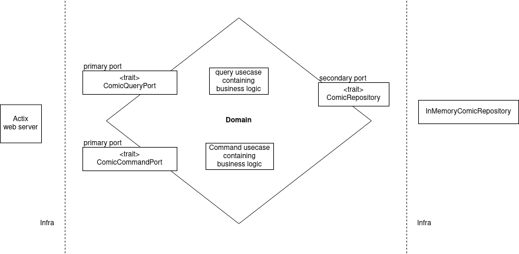

# hexagonal-rust

### Purpose
This **POC** is an attempt at using an **hexagonal architecture** in a **Rust** codebase while learning the language.


Pros:
- The domain and business logic are isolated from any infrastructure code thanks to multiple rust sub-projects;
- Domain is easily testable;
- It is possible to implement various secondary adapters as long as it complies with the domain port. As an example, the InMemoryComicRepository may be easily replaced by another adapter with a database implementation. This will have no impact on the domain and business rules.

Cons:
- This is probably not the idiomatic way for a Rust project since this is quite OOP oriented.
- A lot of improvements may be done. For instance, avoiding to box ports in the domain.


This application starts an actix web server. A struct named `WebState` is provided as a state_factory to be used in routes. This struct does not know which implementation of the ports are used.

## Hexagonal implementation
 

## Run in development or production mode
Purpose was just to showcase the use of various config files:

- Start the web server in development mode:
`cargo run`

- Start the web server in production mode:
`RUN_MODE=production cargo run`

Behind the scenes, this will only swap the "debug" flag. This was simply to simulate various settings environments.

Example: (note the `debug: Ok(true)`)
```
🚀 cargo run                    
    Finished dev [unoptimized + debuginfo] target(s) in 0.22s
     Running `target/debug/hexagonal-rust`
debug: Ok(true) 
web: Ok(Web { port: 9090 })
```


## Some simple valid queries 

Let's find a comic book thanks to its upc (`1234` and `4567` are available).

Examples:

`curl http://127.0.0.1:9090/comics/1234`

```
🚀 curl http://127.0.0.1:9090/comics/1234 -v
*   Trying 127.0.0.1:9090...
* Connected to 127.0.0.1 (127.0.0.1) port 9090 (#0)
> GET /comics/1234 HTTP/1.1
> Host: 127.0.0.1:9090
> User-Agent: curl/7.75.0
> Accept: */*
> 
* Mark bundle as not supporting multiuse
< HTTP/1.1 200 OK
< content-length: 62
< content-type: application/json
< date: Thu, 11 Mar 2021 12:44:04 GMT
< 
* Connection #0 to host 127.0.0.1 left intact
{"upc":"1234","title":"batman#1","description":"joker war #1"}
```


`curl http://127.0.0.1:9090/comics/7777`


```
🚀 curl http://127.0.0.1:9090/comics/7777 -v
*   Trying 127.0.0.1:9090...
* Connected to 127.0.0.1 (127.0.0.1) port 9090 (#0)
> GET /comics/7777 HTTP/1.1
> Host: 127.0.0.1:9090
> User-Agent: curl/7.75.0
> Accept: */*
> 
* Mark bundle as not supporting multiuse
< HTTP/1.1 404 Not Found
< content-length: 0
< date: Thu, 11 Mar 2021 12:46:46 GMT
< 
* Connection #0 to host 127.0.0.1 left intact
```
